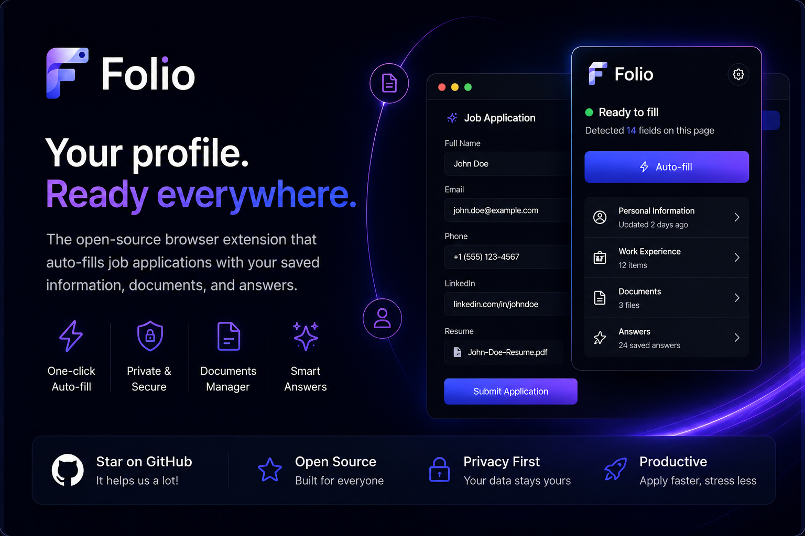

# Folio

**Your profile. Ready everywhere.**

Folio is a privacy-first browser extension that helps you fill job applications faster using your saved profile, documents, and reusable answers. Build your professional profile once, keep it local, and let Folio handle the repetitive form work when you decide it should.

> **Work in progress:** Folio is a personal project and still evolving. It is not a polished commercial product yet, and it has not been security audited. Expect rough edges while the idea keeps getting sharper.



## Why Folio Exists

Job applications ask for the same information over and over:

- Name, email, phone, location, links
- Education and work history
- Resume or CV uploads
- Skills, custom answers, and repeat application questions

Folio turns that repetition into a local profile you control. Open the popup, scan the current page, and fill matched fields with one click.

## What It Does

- **One-click autofill:** Detects matching fields on the current page and fills them only after you click the autofill button.
- **Local profile manager:** Store personal info, education, experience, skills, custom answers, and documents.
- **Resume library:** Upload resumes/CVs, tag them, preview them, zoom in, download, set a default, and delete with confirmation.
- **Resume upload support:** When a website asks for a resume or CV, Folio can attach the selected saved document during autofill.
- **Visible fill indicators:** Fields filled by Folio get a subtle blue outline and pulse so you can instantly see what changed.
- **Autofill activity dashboard:** Track forms filled, fields filled, estimated time saved, and small productivity comparisons.
- **Private by design:** Profile data lives in browser storage. No account, no backend, no telemetry.
- **Themeable settings:** Light, dark, and auto modes with a premium Folio-style interface.
- **Manual control:** Folio never submits applications automatically.

## Privacy Model

Folio is designed around a simple rule: **your application data should stay yours.**

- Data is stored locally with `chrome.storage.local`.
- The extension does not send your profile to a server.
- There is no analytics or telemetry.
- Autofill only runs after a user action.
- Folio does not click submit buttons.

The current Manifest V3 build uses broad host permissions so it can scan many application forms across the web. That is practical for the prototype, but the permission model may become more scoped as platform-specific support matures.

## Current Status

Folio is currently an experimental personal project. It already works as a local extension prototype, but it is still being shaped.

Good things already in place:

- Popup scanning and autofill flow
- Options/settings dashboard
- Local JSON import/export
- Country/city selectors
- Resume/CV document manager
- Field matching across common English and French labels
- Autofill metrics
- Chrome extension build output

Still improving:

- More job board/platform-specific matching
- Better handling for complex custom dropdowns
- More languages
- Smaller production bundles
- More testing on real application sites
- Chrome Web Store packaging polish

## Install Locally

Folio is not published to the Chrome Web Store yet. To try it locally:

```bash
npm install
npm run build
```

Then load it in Chrome:

1. Open `chrome://extensions`.
2. Enable **Developer mode**.
3. Click **Load unpacked**.
4. Select the generated `dist` folder.
5. Pin Folio from the extensions menu.

## Development

```bash
npm install
npm run dev
npm run build
```

Project structure:

```text
src/popup       Extension popup UI
src/options     Settings and profile manager
src/content     Page scanning and autofill content script
src/shared      Matching, storage, types, profile helpers
public          Manifest, extension icons, static assets
```

## Tech Stack

- React
- TypeScript
- Vite
- Manifest V3
- shadcn/ui + Radix primitives
- Tailwind CSS
- Recharts
- `country-state-city`

## Safety Notes

Folio is an autofill assistant, not an application bot.

It does not submit applications, does not bypass site flows, and does not make decisions for you. Always review filled fields before submitting anything important.

## License

MIT

## A Small Ask

If you like the idea, star the repo. It helps a lot and makes the project feel a little more real.
