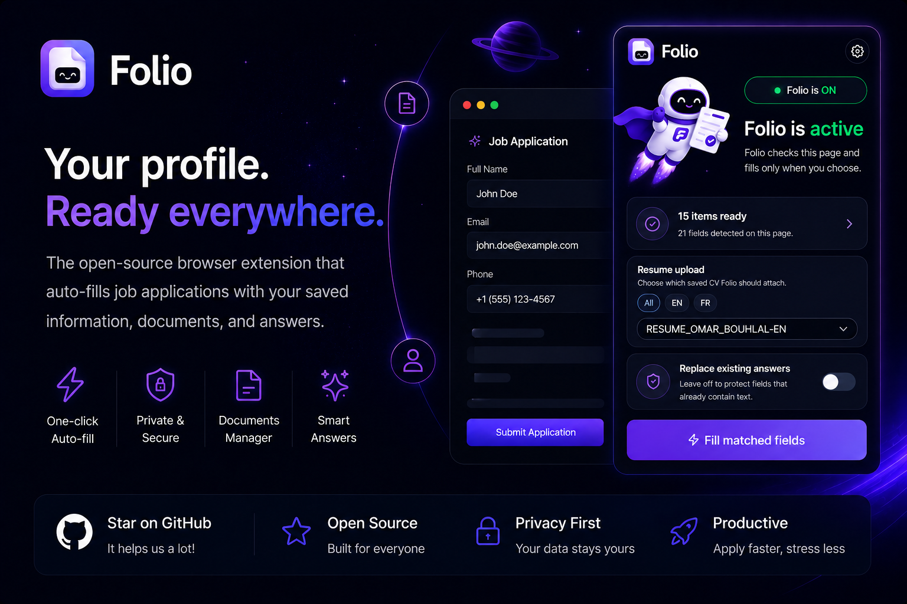

# Folio

**Your profile. Ready everywhere.**

Folio is a privacy-first browser extension that helps you fill job applications faster using your saved profile, documents, and reusable answers. Build your professional profile once, keep it local, and let Folio handle the repetitive form work when you decide it should.

> **Work in progress:** Folio is a personal project and still evolving. It is not a polished commercial product yet, and it has not been security audited. Expect rough edges while the idea keeps getting sharper.



## Why Folio Exists

Job applications ask for the same information over and over:

- Name, email, phone, location, links
- Education and work history
- Resume or CV uploads
- Skills, custom answers, and repeat application questions

Folio turns that repetition into a local profile you control. Open the popup, scan the current page, and fill matched fields with one click.

## What It Does

- **One-click autofill:** Detects matching fields on the current page and fills them only after you click the autofill button.
- **Local profile manager:** Store personal info, education, experience, skills, custom answers, and documents.
- **Resume library:** Upload resumes/CVs, tag them, preview them, zoom in, download, set a default, and delete with confirmation.
- **Resume upload support:** When a website asks for a resume or CV, Folio can attach the selected saved document during autofill.
- **Visible fill indicators:** Fields filled by Folio get a subtle blue outline and pulse so you can instantly see what changed.
- **Autofill activity dashboard:** Track forms filled, fields filled, estimated time saved, and small productivity comparisons.
- **Private by design:** Profile data lives in browser storage. No account, no backend, no telemetry.
- **Themeable settings:** Light, dark, and auto modes with a premium Folio-style interface.
- **Manual control:** Folio never submits applications automatically.

## Privacy Model

Folio is designed around a simple rule: **your application data should stay yours.**

- Data is stored locally with `chrome.storage.local`.
- The extension does not send your profile to a server.
- There is no analytics or telemetry.
- Autofill only runs after a user action.
- Folio does not click submit buttons.

The current Manifest V3 build asks for page access so Folio can detect fields on job applications, match them with your saved profile, and fill them only when you click autofill. As Folio matures, the goal is to keep that access as understandable and focused as possible while still working across many application websites.

## Roadmap & Progress

Folio is a personal project and still a work in progress, but the core extension is already usable locally.

- [X]  Popup scanning and one-click autofill flow
- [X]  Local profile manager for personal info, education, experience, skills, documents, and answers
- [X]  Resume/CV document manager with tags, preview, zoom, download, default selection, and deletion confirmation
- [X]  Resume/CV attachment during autofill when websites ask for uploads
- [X]  Local JSON import/export
- [X]  Country and city selectors
- [X]  Field matching across common English and French labels
- [X]  Custom answers that can be reused for recurring application questions
- [X]  Autofill metrics for forms filled, fields filled, and estimated time saved
- [X]  Chrome extension build output
- [ ]  Nicer UI/UX settings with hand-crafted details (working on it)
- [ ]  Auto import using your resume for the first configuration
- [ ]  Better handling for complex custom dropdowns
- [ ]  Chrome Web Store packaging polish

## Install Locally

Folio is not published to the Chrome Web Store yet. To install it manually, download a release build and load it in Chrome:

1. Go to the [Folio releases page](https://github.com/omarbhl/Folio/releases).
2. Download the latest release zip.
3. Unzip it somewhere on your computer.
4. Open `chrome://extensions` in Chrome.
5. Enable **Developer mode**.
6. Click **Load unpacked**.
7. Select the unzipped extension folder. If the release contains a `dist` folder, select `dist`.
8. Pin Folio from the extensions menu.

For development builds from source:

```bash
npm install
npm run build
```

## Development

```bash
npm install
npm run dev
npm run build
```

Project structure:

```text
src/popup       Extension popup UI
src/options     Settings and profile manager
src/content     Page scanning and autofill content script
src/shared      Matching, storage, types, profile helpers
public          Manifest, extension icons, static assets
```

## Tech Stack

- React
- TypeScript
- Vite
- Manifest V3
- shadcn/ui + Radix primitives
- Tailwind CSS
- Recharts

## Safety Notes

Folio is an autofill assistant, not an application bot.

It does not submit applications, does not bypass site flows, and does not make decisions for you. Always review filled fields before submitting anything important.

## License

MIT

## A Small Ask

If you like the idea, star the repo. It helps a lot and makes the project feel a little more real.
